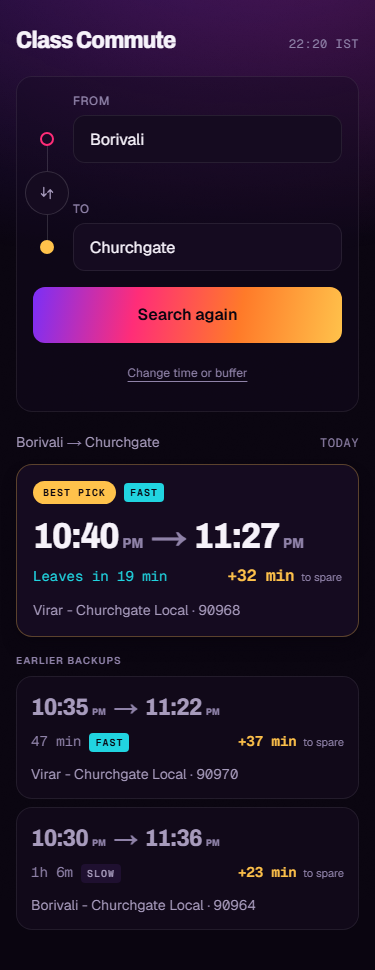
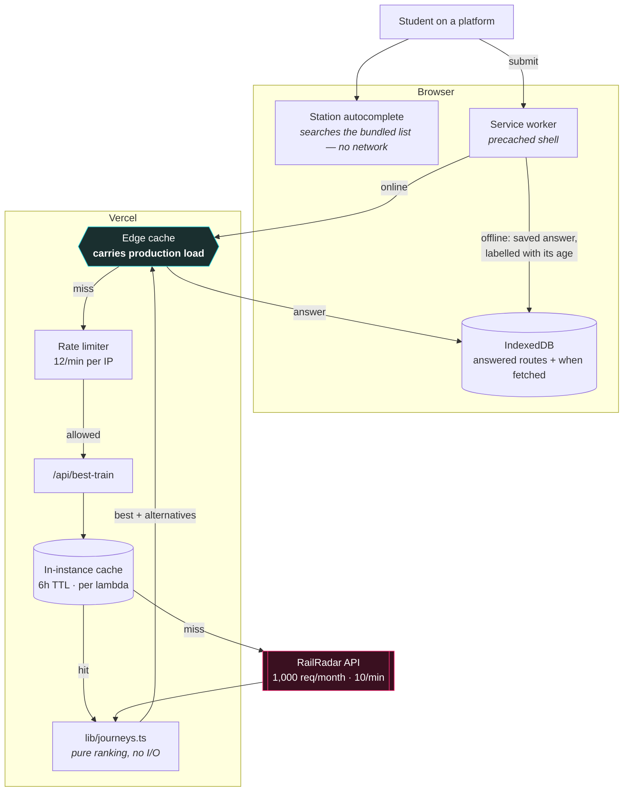

# Class Commute

**Class Commute tells a Mumbai student which local train to catch.** You give it
your home station, your college station, what time class starts and how long you
want free beforehand; it gives you the **latest train that still gets you there
on time** — the one that cuts it closest without making you late — plus a few
earlier backups. It is built for someone standing on a platform at 07:40, on one
bar of signal, deciding whether to run.

<!-- Live URL goes here once deployed: see "Deploying" below. -->

<p align="center">
  
</p>

---

## How it works



Every layer above the RailRadar box exists to avoid touching it. The free tier is
1,000 requests a month — about 33 a day for the whole user base — which makes the
upstream call the scarcest resource in the project, scarcer than CPU or bundle
bytes. The **edge cache** is the layer that carries real load: two students on
the same line share one upstream call, because the CDN answers the second without
running a function at all.

## Why it is built this way

The reasoning lives in architecture decision records, one per decision, so it
does not have to be re-derived from the code:

| ADR | Decision |
|---|---|
| [1](docs/adr/0001-bundle-the-station-list.md) | **Bundle the station list** rather than searching it upstream — typing used to cost 4–6 upstream calls per journey; it now costs zero |
| [2](docs/adr/0002-layered-caching.md) | **Layer the caches**, and be explicit that the in-instance cache is per-lambda while the edge cache is what carries production |
| [3](docs/adr/0003-offline-first.md) | **Offline-first**, because platforms have no signal — including what is deliberately *not* available offline |
| [4](docs/adr/0004-ranking-one-change-journeys.md) | **Rank one-change journeys** against direct ones with a 15-minute penalty, and why one change and not two |
| [5](docs/adr/0005-no-user-accounts.md) | **No user accounts**, and what that costs |

## Known limitations

Real ones, not a formality:

- **No routing to the far half of an interchange.** Borivali to Dadar *Central*
  is answered as "no route" rather than "ride to Dadar Western and walk over the
  bridge". Dadar is two station codes because it is two buildings, and the app
  does not model walking between them.
- **One change maximum.** Two-change journeys are not planned at all. On this
  network that is nearly always a journey better served by another mode, and each
  extra leg multiplies both the quota cost and the risk of a missed connection
  ([ADR 4](docs/adr/0004-ranking-one-change-journeys.md)).
- **Timetable staleness is real and visible.** Answers can be served from a
  cached timetable up to 6 hours old, or from this device up to 7 days old when
  offline. They are always labelled with the moment they were fetched, but a
  label is not freshness.
- **Scheduled times, not live running.** The app has no delay or platform data.
  It tells you when a train is *meant* to leave. Check the board when you arrive.
- **The free tier is a hard ceiling.** 1,000 requests a month across all users.
  Past 85% the app starts serving stale timetables rather than failing, but a
  genuinely popular day would exhaust it, and the app has no paid fallback.
- **The station list is a build artefact.** A new or renamed station needs `npm
  run stations:refresh` and a commit; it will not appear on its own.
- **The interchange model is hand-authored.** `lib/network.ts` encodes which line
  each station is on from knowledge of the city, not from data. A station missing
  from it degrades safely to direct-only, but silently.
- **Per-instance counters.** Quota accounting and rate limiting are per lambda
  instance, so both are a floor rather than an exact figure
  ([ADR 2](docs/adr/0002-layered-caching.md)).

## Getting started

```bash
npm install
cp .env.example .env.local   # then add your key
npm run dev                  # http://localhost:3000
```

`.env.local` needs one variable:

```
RAILRADAR_API_KEY=your_railradar_api_key_here
```

Get a key at [railradar.in](https://railradar.in). It is **server-side only** —
read in exactly one place (`lib/railradar.ts`), never prefixed `NEXT_PUBLIC_`,
never sent to the browser. The client talks only to this app's own `/api/*`
routes.

### Scripts

| Command | What it does |
|---|---|
| `npm run dev` | Development server |
| `npm run build` | Production build, then builds the service worker |
| `npm run typecheck` | `next typegen && tsc --noEmit` — the typegen step is required, not incidental: `app/layout.tsx` uses `LayoutProps<"/">`, which Next generates into `.next/types/` and is gitignored, so a fresh clone cannot typecheck without it |
| `npm run lint` | ESLint |
| `npm run test` | Unit tests (Vitest) |
| `npm run test:e2e` | End-to-end tests (Playwright) |
| `npm run analyze` | Bundle report to `.next/analyze/` |
| `npm run stations:refresh` | Regenerate the bundled station list — **spends quota** |
| `npm run icons:build` | Regenerate `public/icons/` |

Some end-to-end specs need a live key and a production build, so they are opt-in:

```bash
npm run build && npm start
RAILRADAR_ACCEPTANCE=1 PORT=3000 npx playwright test e2e/offline.spec.ts
```

## Project structure

**The rules that hold it together.** `app/api/*` depends on `lib/*` and never the
reverse. `lib/time.ts` is the only place that knows about `Asia/Kolkata` — Vercel
runs in UTC, and a stray `new Date().getHours()` is how the app once recommended
a train that had already left. `lib/railradar.ts` is the only place that talks to
the network. `lib/bestTrain.ts` and `lib/journeys.ts` are pure: they take the
clock as an argument so they are testable without mocking time.

| Path | Role |
|---|---|
| `lib/time.ts` | Every `Asia/Kolkata` concern, in one place |
| `lib/railradar.ts` | The only module that talks to RailRadar; owns the key and the error taxonomy |
| `lib/upstreamError.ts` | What an upstream failure is allowed to say out loud |
| `lib/journeys.ts` | Ranking direct and one-change journeys against each other (pure) |
| `lib/bestTrain.ts` | Best-train selection (pure, no clock reads) |
| `lib/network.ts` | Hand-authored line/interchange model of the suburban network |
| `lib/pace.ts` | FAST/SLOW classification, calibrated against live data |
| `lib/stations.ts` + `lib/data/` | The bundled station list and the client-side search over it |
| `lib/cache.ts` · `lib/quota.ts` · `lib/rateLimit.ts` | The quota machinery |
| `lib/offlineCache.ts` · `lib/requestBestTrain.ts` | IndexedDB store, and the live/saved/fail decision table |
| `lib/schemas.ts` | Zod request schemas with user-facing error copy |
| `app/api/best-train/` | The main endpoint (GET, edge-cacheable) |
| `app/api/stations/search/` | Station search **fallback only** — costs quota, off the typing path |
| `app/api/dev/quota/` | Usage report; 404s in production |
| `app/sw.ts` · `app/manifest.ts` | Service worker source and web app manifest |
| `components/` | Client components; they call this app's own routes and nothing else |
| `scripts/` | Build-time tools. Not app code — they may call RailRadar directly |
| `design-shots/` | The six interface states at 375px and 1280px |

## Data gotchas

Non-obvious, and each cost real time to discover:

- **RailRadar matches Indian Railways' literal abbreviated names.** Searching
  "Churchgate" returns nothing; the record is `BMBY CHURCH GTE`. Expect
  `BDTS`-style truncation throughout. This is why the bundled list carries
  hand-written aliases.
- **It returns HTTP 200 for station codes it does not recognise** — a success
  envelope with an empty `trains` array, echoing the invalid code back as the
  station *name*. `isRecognizedStation()` exists purely to catch that; without
  it, a typo shows "no trains found" instead of "that isn't a station".
- **`runDays` is a lowercase 3-letter array** (`["mon","tue"]`). Compare against
  the **journey** date's weekday, not today's: at 23:00 on Sunday, a 09:00 class
  is Monday's.
- **A leg's `day` field is 1-indexed from departure, not a date.** A train
  leaving 23:50 and arriving 00:20 has `to.day === 2`. Sorting by `HH:MM` alone
  puts it first instead of last — convert to absolute minutes first. Invisible in
  daytime testing.

## Deploying

The app is a standard Next.js App Router project; Vercel's defaults build it
as-is.

```bash
npm i -g vercel
vercel login
vercel link
vercel env add RAILRADAR_API_KEY production   # repeat for preview, development
vercel --prod
```

The only required configuration is `RAILRADAR_API_KEY`, which must be set for
every environment you intend to use. Then put the deployment URL at the top of
this file.

## Licence

Not currently licensed for reuse.
